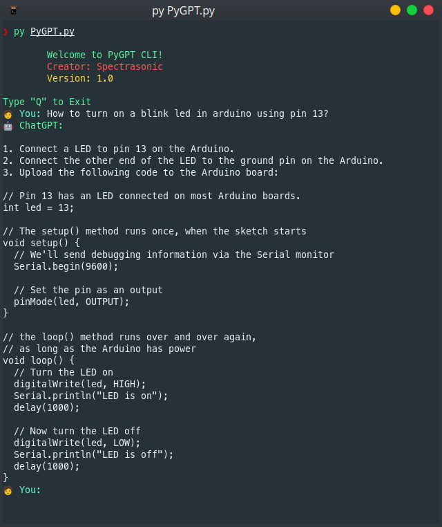

**PyGPT**: a **OpenAI** terminal client, writen in python

# Preview



# Installation

**In Linux:**

Needs:

-   **Python 3.x**

Python libs needed:

-   openai
-   pyxdg
-   colorama

and run in the project dir:

```bash
sudo make install
```

> When you run the installer, the necessary python libraries will be installed automatically.

> In case it doesn't install automatically, use: `python3 -m pip install -r ./requirements.txt` to install the libraries

> it might work on macOS

## Run chat

use `pygpt` command for open chat

## OpenAI Token

**IMPORTANT!**

You need [**OpenAI token**](https://platform.openai.com/docs/introduction/tokens) for the program works

Add your token by editing `~/.config/openai_client.conf`

> If the file does not exist, the first time you run the program will be create the file.

**Example**

```bash
[openai]
token = YOU_TOKEN_HERE
```

## Contribute

-   You can help by sending changes and improvements to the repository by issues
-   Share the repo
-   Leave your star :)

Thank you for using!

---

## Future Features - TO DO -

-   Remember messages
-   Interactive chat
-   Syntactic highlighting

---

<br>

<p align="right">  with  by <strong>Spectrasonic</strong><p>
